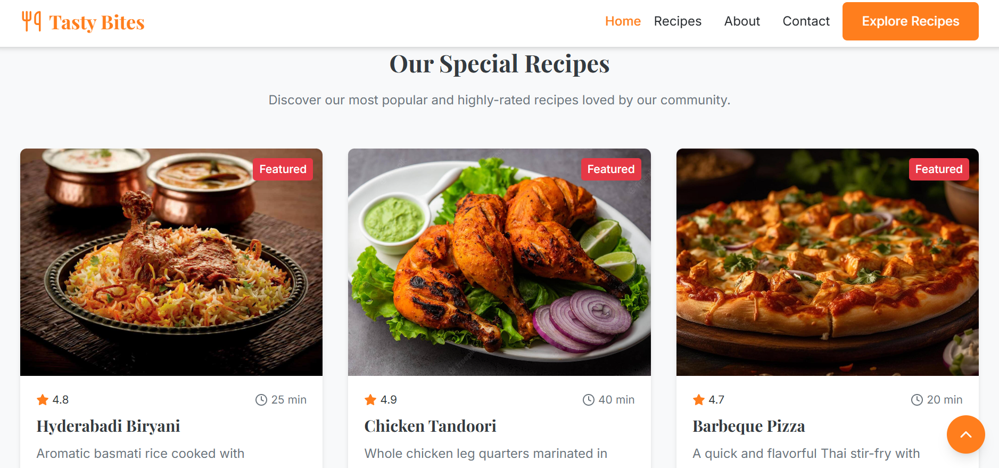
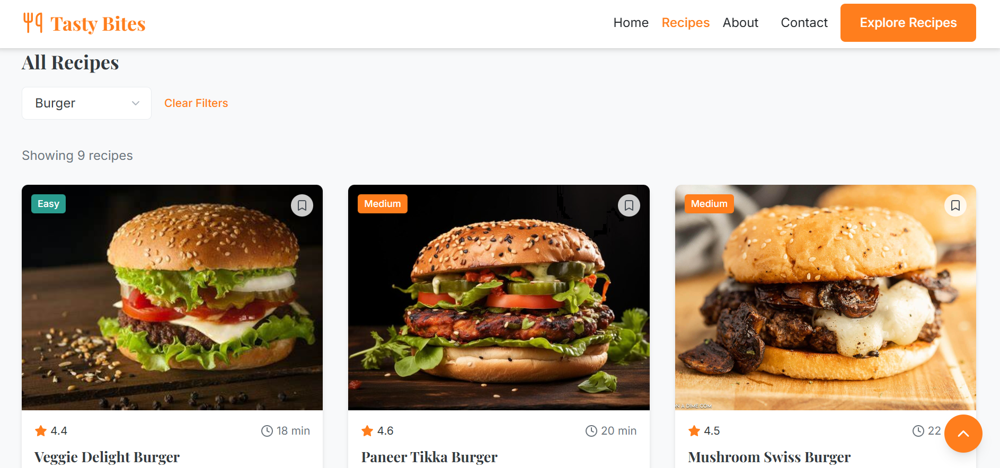
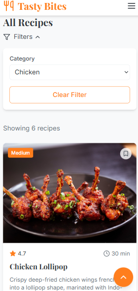

# 🍽️ Tasty Bites – Frontend Web Application

Tasty Bites is a modern and responsive frontend web application designed for a food/restaurant platform. The project focuses on delivering an attractive user interface, smooth user experience, and clean layout to showcase food items, menus, and restaurant details.

---

## ✨ Project Highlights

* Visually appealing and user-friendly UI
* Fully responsive design (mobile, tablet, and desktop)
* Smooth navigation and interactive components
* Clean and structured frontend code
* Focused on design, layout, and user experience

---

## 🎨 Key Features

### 🏠 Home Page

* Attractive landing section
* Restaurant branding and tagline
* Call-to-action buttons

### 📋 Menu Section

* Display of food items with images
* Item names, prices, and descriptions
* Well-structured card-based layout

### 🔍 Search & Filter (if applicable)

* Easy search for food items
* Category-based filtering

### 📱 Responsive Design

* Optimized for all screen sizes
* Mobile-first approach

### 🎯 UI/UX Design

* Modern color palette
* Consistent typography
* Smooth hover and transition effects

---

## 🛠️ Tech Stack
* React.js
* TypeScript
* Tailwind CSS

---

## 📸 Screenshots

Add screenshots of the application UI below.

### 🏠 Home Page

### 📋 Featured recipe Page

### 🍔 Categories Section

### 🍔 All recipes

### 📱 Mobile View

---

## 🎯 Project Purpose

This project was built to strengthen frontend development skills, focusing on responsive design, UI/UX principles, and real-world website layout implementation. It is suitable for showcasing in portfolios and frontend-focused roles.

---

## 🚀 Future Enhancements

* Add cart and checkout UI
* Integrate backend APIs
* User authentication UI
* Animations and transitions

---

## 📄 License

This project is created for learning and portfolio purposes.
